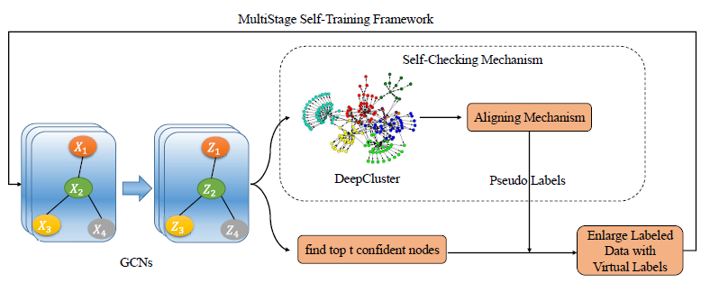

# M3S_Pytorch

Implementation of Multi-Stage Self-Supervised Learning for Graph Convolutional Networks on Graphs with Few Labels.

A PyTorch implementation of "<a href="https://arxiv.org/abs/1902.11038">Multi-Stage Self-Supervised Learning for Graph Convolutional Networks on Graphs with Few Labels</a>" paper, accepted in AAAI 2020 Workshop.

To implement the details, I refer official codes of <a href="https://github.com/liqimai/gcn/tree/AAAI-18/">"Deeper Insights into Graph Convolutional Networks
for Semi-Supervised Learning".</a>

</img>

## Requirements
- Python version : 3.9.7
- Pytorch version : 1.10.1
- torch-geometric version : 2.0.3

### Hyperparameters

`--dataset:`
Name of the dataset. Supported names are: cora, citeseer, pubmed, computers, photo.  
usage example :`--dataset computers`

`--label_rate:`
Percentage of labeled nodes.  
usage example :`--label_rate 0.15`

`--stage:`
Number of stage to pseudo-label.  
usage example :`--stage 3`

`--clustering:`
Whether or not to check the pseudo-label using k-means clustering 
False : Self-Training / True : M3S   
usage example :`--clustering`

`--num_k:`
The number of clusters for k-means clustering
usage example :`--num_k 3`

```
python main.py --dataset computers --label_rate 0.15 --clustering
```


## Experimental Results

<table>
  <tr align="center">
    <td> Methods </td> <td colspan="3" >Cora</td> <td colspan="3" >Citesser</td> <td colspan="3" >Pubmed</td> <td colspan="3" >Am. Computers</td> <td colspan="3" >Am. Photos</td>
  </tr>
  <tr align="center">
    <td> Label Rate </td> <td> 0.5% </td> <td> 1% </td> <td> 2% </td> <td> 0.5% </td> <td> 1% </td> <td> 2% </td> <td> 0.03% </td> <td> 0.06% </td> <td> 0.1% </td> <td> 0.15% </td> <td> 0.2% </td> <td> 0.25% </td> <td> 0.15% </td> <td> 0.2% </td> <td> 0.25% </td>
  </tr>
  
  <tr align="center">
    <td> Self-training </td> <td> 57.28 </td> <td> 70.73 </td> <td> 75.40 </td> <td> 46.26 </td> <td> 60.36 </td> <td> 66.47 </td> <td> 57.34 </td> <td> 65.13 </td> <td> 72.86 </td> <td> 61.32 </td> <td> 65.95 </td> <td> 68.66 </td> <td> 61.92 </td> <td> 65.24 </td> <td> 71.34 </td>
  </tr>
    
  <tr align="center">
    <td> M3S </td> <td> 64.46 </td> <td> 72.93 </td> <td> 76.41 </td> <td> 55.07 </td> <td> 65.74 </td> <td> 67.64 </td> <td> 61.53 </td> <td> 64.60 </td> <td> 73.18 </td> <td> 61.51 </td> <td> 66.30 </td> <td> 68.10 </td> <td> 63.93 </td> <td> 67.62 </td> <td> 73.39 </td>
  </tr>
  
</table>

